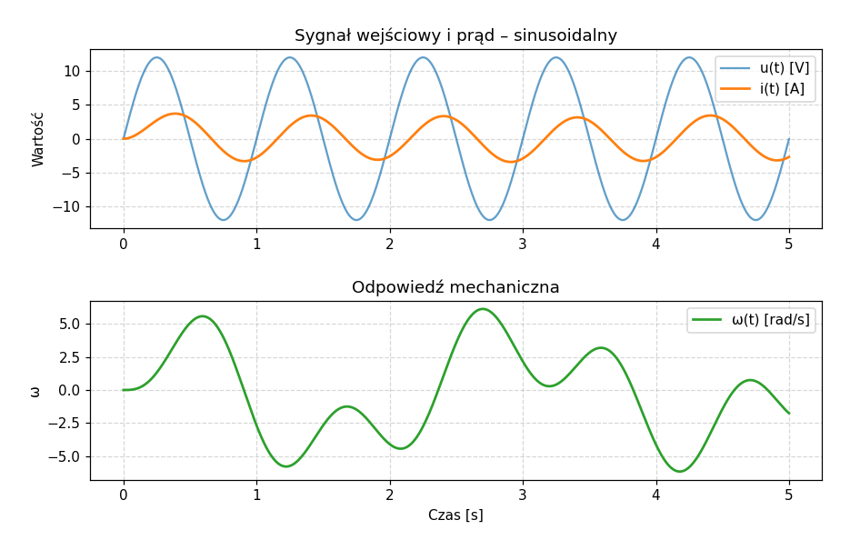
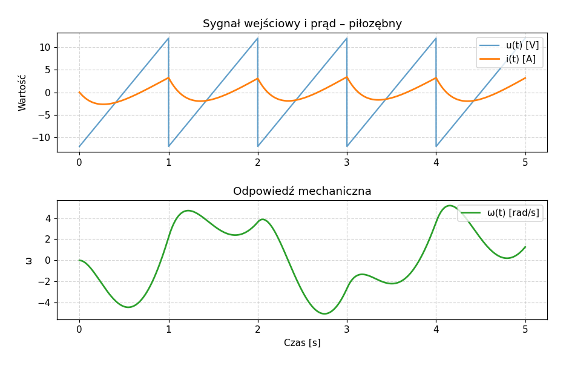
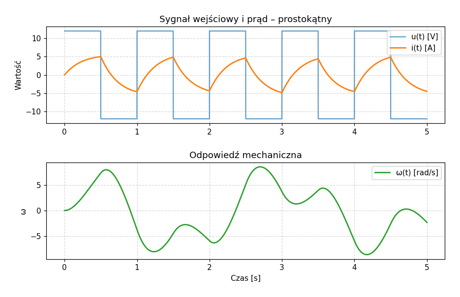
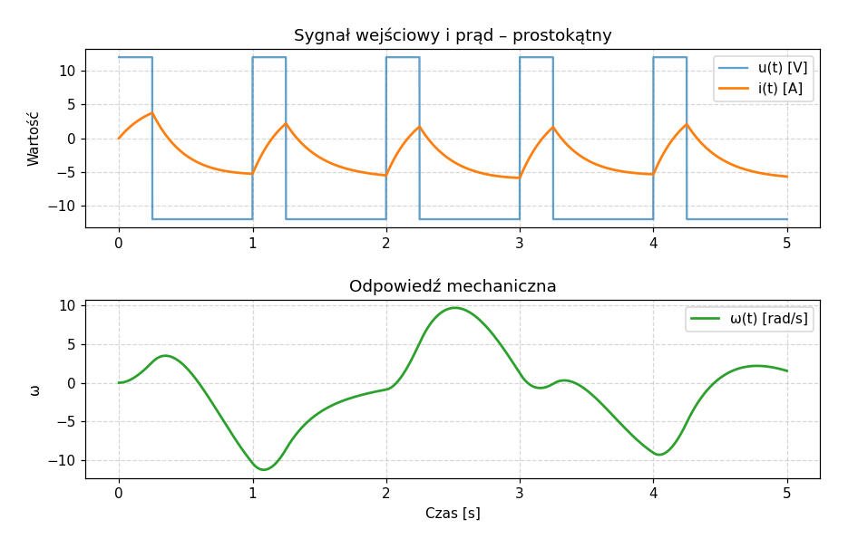

# Sprawozdanie z projektu MMM — Projekt nr 6

**Temat:** Modelowanie i symulacja silnika elektrycznego (układu elektromechanicznego)
sprzężonego sprężyną z otoczeniem.

**Repozytorium:** `projekt_MMM`
**Pliki źródłowe:** `uklad.py` (model i symulacja), `main.py` (interfejs graficzny GUI w CustomTkinter)

---

## 1. Cel projektu

Należało:

1. opracować **model matematyczny** silnika elektrycznego, w którym uzwojenie twornika
   (obwód elektryczny R-L z SEM) jest sprzężone z bezwładnością mechaniczną \(J\)
   poprzez stałe \(K_T\) (moment) i \(K_e\) (SEM), a wał silnika obciążony jest
   sprężyną o sztywności \(k\);
2. zaimplementować **symulator** numeryczny pozwalający wykreślić przebiegi prądu
   \(i(t)\) w obwodzie i prędkości kątowej \(\omega(t)\) wału;
3. umożliwić pobudzanie układu **co najmniej trzema typami sygnałów wejściowych** —
   prostokątnym, trójkątnym/piłokształtnym i harmonicznym (sinusoidalnym);
4. udostępnić możliwość zmiany wszystkich parametrów układu i sygnałów wejściowych
   z poziomu interfejsu użytkownika.

---

## 2. Schemat układu i wielkości fizyczne

Układ składa się z dwóch wzajemnie sprzężonych części:

**Część elektryczna (lewa pętla obwodu):**

- źródło napięcia wymuszającego \(u(t)\),
- rezystancja uzwojenia \(R\),
- indukcyjność uzwojenia \(L\),
- siła przeciwelektromotoryczna twornika \(e_m\) (modelowana jako element zależny
  od prędkości obrotowej wału).

**Część mechaniczna (prawa strona):**

- bezwładność \(J\) wału,
- kąt obrotu \(\theta\),
- prędkość kątowa \(\omega = \dot\theta\),
- sprężyna o sztywności \(k\) zwracająca wał w położenie \(\theta = 0\).

**Sprzężenia elektromechaniczne** (zgodnie z treścią zadania):

\[
T = K_T \, i, \qquad e_m = K_e \, \dot\theta = K_e \, \omega .
\]

---

## 3. Wyprowadzenie modelu matematycznego

### 3.1. Równanie obwodu elektrycznego (II prawo Kirchhoffa)

Sumując spadki napięć w pętli zawierającej źródło \(u(t)\), rezystor, cewkę
i SEM przeciwną silnika, otrzymujemy:

\[
u(t) \;=\; R\,i(t) \;+\; L\,\frac{\mathrm{d}i(t)}{\mathrm{d}t} \;+\; e_m(t).
\]

Po podstawieniu \(e_m = K_e\,\omega\) i przekształceniu względem pochodnej prądu:

\[
\boxed{\;\frac{\mathrm{d}i}{\mathrm{d}t} \;=\; \frac{1}{L}\Bigl(u(t) \;-\; R\,i \;-\; K_e\,\omega\Bigr).\;}
\tag{3.1}
\]

### 3.2. Równanie ruchu obrotowego (II zasada dynamiki)

Bilans momentów na wale silnika:

\[
J\,\ddot\theta \;=\; T \;-\; M_{\text{spr}} \;=\; K_T\,i \;-\; k\,\theta.
\]

Wprowadzając \(\omega = \dot\theta\) (czyli \(\ddot\theta = \dot\omega\)):

\[
\boxed{\;\frac{\mathrm{d}\omega}{\mathrm{d}t} \;=\; \frac{1}{J}\Bigl(K_T\,i \;-\; k\,\theta\Bigr).\;}
\tag{3.2}
\]

### 3.3. Definicja kinematyczna

\[
\boxed{\;\frac{\mathrm{d}\theta}{\mathrm{d}t} \;=\; \omega.\;}
\tag{3.3}
\]

### 3.4. Wektor stanu i postać macierzowa

Definiujemy wektor zmiennych stanu

\[
\mathbf{x}(t) \;=\; \begin{bmatrix} i(t) \\ \omega(t) \\ \theta(t) \end{bmatrix},
\qquad u_{\text{wej}}(t) = u(t).
\]

Łącząc równania (3.1)–(3.3) w postać \(\dot{\mathbf{x}} = A\,\mathbf{x} + B\,u\):

\[
\frac{\mathrm{d}}{\mathrm{d}t}
\begin{bmatrix} i \\ \omega \\ \theta \end{bmatrix}
\;=\;
\underbrace{
\begin{bmatrix}
-\dfrac{R}{L} & -\dfrac{K_e}{L} & 0 \\[6pt]
\phantom{-}\dfrac{K_T}{J} & 0 & -\dfrac{k}{J} \\[6pt]
0 & 1 & 0
\end{bmatrix}
}_{A}
\begin{bmatrix} i \\ \omega \\ \theta \end{bmatrix}
\;+\;
\underbrace{
\begin{bmatrix} \dfrac{1}{L} \\[4pt] 0 \\[4pt] 0 \end{bmatrix}
}_{B}\, u(t).
\]

Wektor wyjść symulatora to \(y = \begin{bmatrix} i & \omega \end{bmatrix}^{\!T}\),
co odpowiada macierzy
\(C = \begin{bmatrix} 1 & 0 & 0 \\ 0 & 1 & 0 \end{bmatrix}\), \(D = \mathbf{0}\).

> **Uwaga:** w schemacie z zadania nie występuje element tłumiący ruchu obrotowego
> (np. tłumik wiskotyczny \(b\dot\theta\)). Zachowano więc model bez tłumienia
> mechanicznego — jedynym „tłumieniem" prędkości obrotowej jest sprzężenie zwrotne
> przez SEM \(K_e\,\omega\) i rezystancję obwodu.

---

## 4. Sygnały wejściowe

Symulator umożliwia pobudzanie układu trzema rodzajami sygnałów. Wszystkie są
generowane w czystym Pythonie (moduł `math`, brak `numpy`/`scipy.signal`),
parametryzowane amplitudą \(A\), częstotliwością \(f\), fazą \(\varphi\)
oraz — dla sygnału prostokątnego — wypełnieniem \(D \in [0,\,1]\).

### 4.1. Sygnał sinusoidalny (harmoniczny)

\[
u(t) = A\,\sin\!\bigl(2\pi f\,t + \varphi\bigr).
\]

### 4.2. Sygnał piłokształtny (zastępuje `signal.sawtooth`)

Definiujemy fazę unormowaną \(\phi(t) = \bigl(f\,t + \tfrac{\varphi}{2\pi}\bigr) \bmod 1\),
a sygnał

\[
u(t) = A\,\bigl(2\,\phi(t) - 1\bigr) \;\in\; [-A,\,A].
\]

### 4.3. Sygnał prostokątny (zastępuje `signal.square`)

Z taką samą fazą \(\phi(t)\):

\[
u(t) =
\begin{cases}
+A, & \phi(t) < D, \\
-A, & \phi(t) \ge D.
\end{cases}
\]

W kodzie odpowiadają tym formułom gałęzie warunku w `calka_eulera`
(linie 23–34 pliku `uklad.py`).

---

## 5. Metoda numeryczna — jawny schemat Eulera

Układ (3.1)–(3.3) jest układem równań różniczkowych zwyczajnych pierwszego rzędu
(\(\dot{\mathbf{x}} = f(\mathbf{x},u,t)\)). Do całkowania zastosowano **jawną
metodę Eulera** o stałym kroku \(\Delta t\):

\[
\mathbf{x}_{n+1} \;=\; \mathbf{x}_{n} + \Delta t \cdot f(\mathbf{x}_{n},\,u_{n},\,t_{n}).
\]

Co po rozwinięciu daje trzy formuły dyskretne:

\[
\begin{aligned}
i_{n+1}      &= i_{n} + \Delta t \cdot \tfrac{1}{L}\bigl(u_{n} - R\,i_{n} - K_e\,\omega_{n}\bigr), \\
\omega_{n+1} &= \omega_{n} + \Delta t \cdot \tfrac{1}{J}\bigl(K_T\,i_{n} - k\,\theta_{n}\bigr), \\
\theta_{n+1} &= \theta_{n} + \Delta t \cdot \omega_{n}.
\end{aligned}
\]

W kodzie zaimplementowane jako:

```40:47:uklad.py
    for n in range(N - 1):
        di_dt = (1/L) * (u[n] - R * i_prad[n] - Ke * omega[n])
        domega_dt = (1/J) * (Kt * i_prad[n] - k * theta[n])
        dtheta_dt = omega[n]

        i_prad[n+1] = i_prad[n] + di_dt * dt
        omega[n+1] = omega[n] + domega_dt * dt
        theta[n+1] = theta[n] + dtheta_dt * dt
```

**Uwagi praktyczne dotyczące stabilności.** Metoda Eulera jawnego jest stabilna
warunkowo. Krok \(\Delta t\) musi być znacznie mniejszy od najmniejszej stałej
czasowej układu — w szczególności od stałej elektrycznej \(\tau_e = L/R\)
oraz od okresu naturalnego oscylatora mechanicznego
\(T_n = 2\pi\sqrt{J/k}\). Dla parametrów domyślnych
(\(R=2\,\Omega,\ L=0{,}5\,\mathrm{H},\ J=0{,}02,\ k=0{,}1\)) mamy
\(\tau_e = 0{,}25\,\mathrm{s}\) i \(T_n \approx 2{,}81\,\mathrm{s}\).
Domyślny krok \(\Delta t = 10^{-3}\,\mathrm{s}\) z dużym zapasem spełnia
warunek stabilności.

---

## 6. Struktura implementacji

Projekt podzielono na dwa pliki:

### `uklad.py` — model i symulator

Funkcja `calka_eulera(...)` realizuje:

1. **Generację wektora czasu** jako listę `czas = [t_start + i*dt for i in range(N)]`
   (zamiast `numpy.linspace`, zgodnie z wymogiem nieużywania `numpy`/`scipy`).
2. **Generację sygnału wejściowego** `u[i]` zgodnie z wybranym typem
   (`sinusoidalny` / `piłozębny` / `prostokątny`) — wzory z rozdz. 4.
3. **Pętlę całkującą Euler** (rozdz. 5).
4. **Zwrócenie krotki** `(czas, u, i_prad, omega)` do prezentacji.

### `main.py` — interfejs użytkownika

Aplikacja oparta o `customtkinter` z dwoma sekcjami:

- **Panel boczny (lewy)** — pola tekstowe na 13 parametrów symulacji
  (czasy, krok, parametry sygnału, parametry obwodu i mechaniki) oraz lista
  rozwijana wyboru typu sygnału. Pole „Wypełnienie" pokazuje się dynamicznie
  tylko dla sygnału prostokątnego (`on_typ_sygnalu_change`).
- **Panel wykresów (prawy)** — `matplotlib` z dwoma podwykresami:
  - górny: \(u(t)\) i \(i(t)\) na wspólnej osi czasu,
  - dolny: \(\omega(t)\).

Przycisk *Generuj Symulację* wywołuje `calka_eulera(...)` z aktualnymi
wartościami pól, a następnie odświeża obydwa wykresy (`canvas.draw()`).

---

## 7. Wygląd symulatora i przykładowe odpowiedzi układu

Poniżej zamieszczono wykresy wygenerowane bezpośrednio z modelu (skrypt
`sprawozdanie/_generuj_wykresy.py`) dla zestawu parametrów domyślnych:

\[
A = 12\,\mathrm{V},\ \ f = 1\,\mathrm{Hz},\ \ R = 2\,\Omega,\ \ L = 0{,}5\,\mathrm{H},
\ \ K_e = K_T = 0{,}1,\ \ J = 0{,}02,\ \ k = 0{,}1,\ \ \Delta t = 10^{-3}\,\mathrm{s},
\ \ T_{\text{sym}} = 5\,\mathrm{s}.
\]

Każdy z rysunków składa się z dwóch podwykresów odpowiadających układowi paneli
w GUI: na górze sygnał wejściowy \(u(t)\) (niebieski) wraz z prądem twornika
\(i(t)\) (pomarańczowy), na dole prędkość kątowa wału \(\omega(t)\) (zielony).

### 7.1. Pobudzenie sinusoidalne



**Obserwacje.** Prąd \(i(t)\) jest również sinusoidalny, lecz przesunięty
w fazie i o mniejszej amplitudzie względem \(u(t)\) — to klasyczne zachowanie
obwodu R-L. Prędkość kątowa \(\omega(t)\) po krótkim stanie przejściowym dąży
do oscylacji o tej samej częstotliwości co wymuszenie. Amplituda \(\omega\)
zależy od relacji częstotliwości wymuszenia do częstotliwości własnej oscylatora
mechanicznego \(\omega_n = \sqrt{k/J}\).

### 7.2. Pobudzenie piłokształtne



**Obserwacje.** Skoki napięcia w punktach nieciągłości (powrót piły do \(-A\))
generują wyraźne skoki pochodnej prądu. Prąd jest „wygładzoną" wersją piły —
indukcyjność \(L\) działa jak filtr dolnoprzepustowy. \(\omega(t)\) zawiera
silną składową niskoczęstotliwościową (związaną z wartością średnią
i podstawową harmoniczną piły) oraz tłumione drgania własne układu mechanicznego.

### 7.3. Pobudzenie prostokątne (\(D = 0{,}5\))



**Obserwacje.** Każda zmiana znaku napięcia wywołuje typową odpowiedź układu
R-L pierwszego rzędu (eksponencjalne wzrosty/spadki prądu z elektryczną stałą
czasową \(\tau_e = L/R\)). \(\omega(t)\) ma kształt zbliżony do trójkątnego
z dodatkowymi drganiami sprężystymi, ponieważ prąd (a więc i moment \(K_T i\))
jest niemal stały odcinkowo, a \(\dot\omega \propto K_T i - k\theta\).

### 7.4. Pobudzenie prostokątne z mniejszym wypełnieniem (\(D = 0{,}25\))



**Obserwacje.** Niesymetryczne wypełnienie powoduje, że średnia wartość
napięcia jest ujemna (\(\bar u = A(2D-1) = -6\,\mathrm{V}\) dla \(D=0{,}25\)),
przez co układ ma niezerowy „bias" — zarówno prąd, jak i prędkość kątowa
oscylują wokół wartości średniej różnej od zera, a położenie wału \(\theta\)
ustala się w nowym położeniu równowagi.

---

## 8. Wpływ wybranych parametrów na wygląd przebiegów

| Zmiana parametru | Skutek widoczny na wykresach |
|---|---|
| \(R \uparrow\) | mniejsza amplituda \(i(t)\), mocniejsze tłumienie stanów przejściowych |
| \(L \uparrow\) | większe wygładzenie \(i(t)\), wolniejsze odpowiedzi na skoki \(u\) |
| \(J \uparrow\) | większa bezwładność: \(\omega(t)\) reaguje wolniej, niższa częstotliwość drgań własnych |
| \(k \uparrow\) | sztywniejsza sprężyna: wyższa częstotliwość oscylacji \(\omega\), mniejsze odchylenie \(\theta\) |
| \(K_T,\,K_e \uparrow\) | silniejsze sprzężenie elektromechaniczne (mocniejsza odpowiedź mechaniczna i większy efekt tłumiący SEM) |
| \(f \uparrow\) | sygnał szybszy niż dynamika układu — układ działa jak filtr dolnoprzepustowy, amplituda odpowiedzi maleje |

---

## 9. Wnioski

1. Model w postaci trzech równań stanu (3.1)–(3.3) wiernie oddaje fizykę
   układu z rysunku zadania: sprzężenie elektromechaniczne realizowane jest
   przez parę \(K_T\,i\) i \(K_e\,\omega\), a obciążenie mechaniczne — przez
   sprężynę \(k\theta\) działającą na bezwładność \(J\).
2. Postać macierzowa \(\dot{\mathbf{x}} = A\mathbf{x} + B\,u\) potwierdza
   liniowość modelu — układ jest LTI, co umożliwia ewentualną dalszą analizę
   w dziedzinie częstotliwości (transmitancje, bieguny).
3. Jawny schemat Eulera jest wystarczający dla rozważanych parametrów —
   krok \(\Delta t = 10^{-3}\,\mathrm{s}\) gwarantuje stabilność i wizualnie
   gładkie przebiegi.
4. Implementacja generatorów sygnałów w czystym Pythonie (`math.sin`,
   modulo na fazie) eliminuje zależność od `scipy.signal` przy zachowaniu
   pełnej funkcjonalności (sinus, piła, prostokąt z dowolnym wypełnieniem).
5. Interfejs CustomTkinter udostępnia wszystkie parametry układu i sygnałów
   wejściowych, zgodnie z wymogiem treści zadania.

---

## 10. Spis plików

```
projekt_MMM/
├── uklad.py                     # model: calka_eulera() + generacja sygnałów
├── main.py                      # GUI (CustomTkinter + matplotlib)
├── README.md
└── sprawozdanie/
    ├── SPRAWOZDANIE.md          # niniejszy dokument
    ├── _generuj_wykresy.py      # skrypt regenerujący wykresy z rozdz. 7
    └── wykresy/
        ├── odpowiedz_sinus.png
        ├── odpowiedz_pila.png
        ├── odpowiedz_prostokat.png
        └── odpowiedz_prostokat_d025.png
```

> Aby ponownie wygenerować wykresy z aktualnym kodem:
> `python sprawozdanie/_generuj_wykresy.py`
